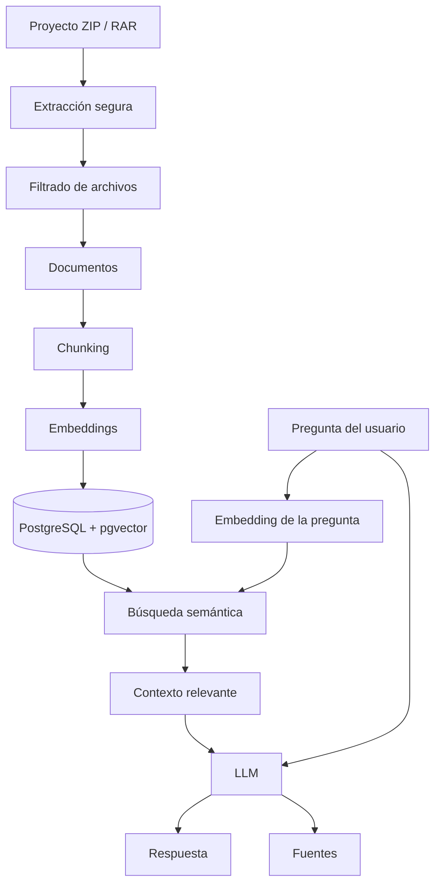

# DevPilot AI

DevPilot AI es un asistente inteligente para desarrolladores capaz de analizar
proyectos de software mediante técnicas de **Retrieval-Augmented Generation
(RAG)**.

La aplicación permite importar un proyecto comprimido, indexar su código fuente
y utilizar Inteligencia Artificial para consultar el código mediante lenguaje
natural, generar documentación técnica y crear tests unitarios utilizando el
contexto real del repositorio.

Proyecto desarrollado como **Trabajo Final de Máster de Inteligencia Artificial
de Founderz**.

## Objetivo del proyecto

Los proyectos de software modernos pueden contener cientos o miles de archivos,
lo que dificulta comprender rápidamente una base de código desconocida.

DevPilot AI transforma un proyecto de software en una base de conocimiento
consultable mediante Inteligencia Artificial.

El flujo principal de procesamiento es:

```text
Proyecto ZIP / RAR
        ↓
Extracción segura
        ↓
Filtrado de archivos
        ↓
Documentos
        ↓
Chunking
        ↓
Embeddings
        ↓
PostgreSQL + pgvector
        ↓
Búsqueda semántica
        ↓
Contexto RAG
        ↓
LLM
        ↓
Respuesta + fuentes
```

## Funcionalidades principales

### Gestión de usuarios

DevPilot AI incorpora autenticación y aislamiento de datos por usuario.

La aplicación permite:

- Registrar usuarios.
- Iniciar sesión.
- Mantener la sesión mediante JWT.
- Restaurar la sesión al recargar la aplicación.
- Proteger las rutas privadas.
- Cerrar sesión.
- Controlar el acceso a proyectos y recursos.
- Evitar el acceso a información perteneciente a otros usuarios.

Cada proyecto pertenece exclusivamente al usuario que lo ha creado.

### Gestión de proyectos

Desde el workspace es posible:

- Crear proyectos.
- Añadir una descripción.
- Subir el código fuente del proyecto.
- Reindexar proyectos existentes.
- Consultar el estado del proyecto.
- Eliminar proyectos y sus datos asociados.

Durante el procesamiento, un proyecto puede pasar por diferentes estados:

```text
CREATED
   ↓
EXTRACTED
   ↓
INDEXED_FILES
   ↓
CHUNKED
   ↓
INDEXED
```

El estado `INDEXED` indica que el proyecto está preparado para ser consultado
mediante IA.

### Importación ZIP y RAR

DevPilot AI permite importar proyectos comprimidos mediante los formatos:

```text
.zip
.rar
```

Los archivos se validan antes de ser procesados.

Si el archivo no es válido o no puede extraerse de forma segura, la aplicación
informa al usuario directamente desde la interfaz.

### Indexación inteligente del código

No todos los archivos de un repositorio aportan información útil a un sistema
RAG.

DevPilot AI filtra automáticamente directorios que normalmente contienen
dependencias, compilaciones o información auxiliar, por ejemplo:

```text
node_modules/
dist/
build/
coverage/
.git/
.idea/
.vscode/
.venv/
```

También se excluyen archivos binarios, imágenes, lockfiles y otros formatos que
no resultan útiles para el análisis semántico del código.

Entre las extensiones soportadas se encuentran:

```text
.ts
.js
.jsx
.tsx
.py
.java
.cs
.go
.html
.css
.scss
.md
.json
.yaml
.yml
.xml
```

## Sistema RAG

El núcleo de DevPilot AI utiliza una arquitectura
**Retrieval-Augmented Generation**.

En lugar de enviar el proyecto completo al modelo de lenguaje, DevPilot AI
recupera únicamente los fragmentos de código relacionados semánticamente con la
pregunta realizada.

Esto permite:

- Reducir el contexto enviado al modelo.
- Mejorar la relevancia de las respuestas.
- Trabajar con proyectos de mayor tamaño.
- Mostrar las fuentes utilizadas para generar cada respuesta.

### Flujo de recuperación aumentada



### Estrategia de chunking

Los documentos indexados se dividen en fragmentos de aproximadamente:

```text
1000 caracteres
```

con un solapamiento aproximado de:

```text
150 caracteres
```

El solapamiento permite conservar parte del contexto entre fragmentos
consecutivos.

### Generación de embeddings

Los chunks son transformados en representaciones vectoriales mediante:

```text
text-embedding-3-small
```

Los embeddings utilizados tienen:

```text
1536 dimensiones
```

y se almacenan en PostgreSQL mediante la extensión `pgvector`.

### Búsqueda semántica

Cuando el usuario realiza una pregunta:

1. Se genera el embedding de la pregunta.
2. Se compara con los embeddings almacenados.
3. Se recuperan los chunks más relevantes.
4. Se construye el contexto RAG.
5. El contexto se combina con la pregunta y el historial necesario.
6. La petición se envía al modelo de lenguaje.
7. Se genera una respuesta contextual.
8. Se muestran las fuentes utilizadas.

## Chat contextual

Una vez que un proyecto ha sido indexado se habilita un chat especializado en
su código fuente.

Ejemplos de preguntas:

```text
¿Cómo funciona el sistema de autenticación?

¿Dónde se gestionan las llamadas HTTP?

Explícame la arquitectura del proyecto.

¿Qué hace este servicio?

¿Dónde se almacena el token?

¿Qué componentes dependen de este servicio?
```

El sistema mantiene el contexto de una conversación y permite continuar
preguntando sobre el mismo proyecto.

Las respuestas del asistente pueden incluir los archivos utilizados como
fuentes.

## Generación automática de README

DevPilot AI puede analizar un proyecto indexado y generar documentación técnica
mediante IA.

El README generado puede:

- Visualizarse dentro de la aplicación.
- Copiarse al portapapeles.
- Descargarse como archivo `README.md`.
- Consultarse junto con las fuentes empleadas.

La generación utiliza información recuperada del propio proyecto.

## Generación automática de tests

También es posible seleccionar un archivo concreto del proyecto y solicitar la
generación de tests unitarios.

El proceso es:

```text
Archivo seleccionado
        +
Contexto relacionado del proyecto
        ↓
Recuperación semántica
        ↓
RAG
        ↓
LLM
        ↓
Test generado
```

El código generado puede:

- Visualizarse en la aplicación.
- Copiarse.
- Descargarse como archivo.
- Consultarse junto con las fuentes utilizadas.

## Arquitectura general

DevPilot AI está compuesto por dos aplicaciones principales:

```text
devpilot-ai/
│
├── backend/
│   └── FastAPI
│
├── docs/
│
└── frontend/
    └── devpilot-frontend/
        └── Angular
```

La comunicación entre frontend y backend se realiza mediante una API REST.

```text
Angular
   ↓
HTTP / REST
   ↓
FastAPI
   ↓
Services
   ↓
PostgreSQL + pgvector
   ↓
OpenAI API
```

## Arquitectura del frontend

El frontend utiliza una arquitectura inspirada en **Clean Architecture**.

```text
Presentation
     ↓
Application
     ↓
Domain
     ↑
Infrastructure
```

### Capa de dominio

Contiene modelos y contratos principales de la aplicación.

Ejemplos:

```text
Project
Conversation
Message
AuthUser
GeneratedReadme
GeneratedUnitTests
```

Esta capa evita depender directamente de detalles como Angular HTTP.

### Capa de aplicación

Contiene los casos de uso.

Algunos ejemplos son:

```text
GetProjectsUseCase
CreateProjectUseCase
DeleteProjectUseCase
UploadProjectArchiveUseCase
AskProjectQuestionUseCase
GenerateReadmeUseCase
GenerateUnitTestsUseCase
```

Los componentes delegan las operaciones de negocio en estos casos de uso.

### Capa de infraestructura

Implementa el acceso a servicios externos.

Ejemplo:

```text
ProjectRepository
        ↓
HttpProjectRepository
        ↓
FastAPI
```

Este diseño permite desacoplar la interfaz de usuario de la implementación de
acceso HTTP.

### Capa de presentación

Contiene las vistas y componentes de la aplicación.

Entre ellos:

```text
Login
Register
Projects
Chat
MainLayout
```

El estado del frontend se gestiona principalmente mediante **Angular Signals**.

## Arquitectura del backend

El backend está desarrollado con FastAPI y separa el acceso HTTP de la lógica
de aplicación.

La estructura conceptual es:

```text
Routers
   ↓
Services
   ↓
Models
   ↓
Database
```

Entre los servicios principales se encuentran:

```text
ProjectArchiveService
ProjectDocumentService
ProjectChunkService
ProjectEmbeddingService
SemanticSearchService
RagService
ConversationService
ReadmeService
UnitTestService
```

Los routers reciben las peticiones HTTP y delegan la lógica en los servicios
correspondientes.

## Modelo de persistencia

DevPilot AI utiliza:

```text
PostgreSQL
+
pgvector
```

Las entidades principales son:

```text
User
Project
Document
Chunk
Conversation
Message
```

La relación conceptual principal es:

```text
User
 └── Projects
      ├── Documents
      │    └── Chunks
      │
      └── Conversations
           └── Messages
```

Los recursos asociados a un proyecto utilizan relaciones y eliminación en
cascada cuando corresponde.

## Stack tecnológico

### Tecnologías del frontend

```text
Angular 22
TypeScript
RxJS
Angular Signals
Reactive Forms
Tailwind CSS 4
Vitest
```

### Tecnologías del backend

```text
Python 3.13
FastAPI
SQLAlchemy 2
Alembic
Psycopg
PyJWT
pwdlib
Argon2
rarfile
OpenAI SDK
pytest
```

### Tecnologías de persistencia

```text
PostgreSQL
pgvector
```

### Tecnologías de inteligencia artificial

```text
OpenAI API
Embeddings
Semantic Search
Retrieval-Augmented Generation
Large Language Models
```

## Seguridad

DevPilot AI incorpora diferentes medidas de seguridad tanto en frontend como en
backend.

### Autenticación segura

Las contraseñas se almacenan utilizando:

```text
Argon2
```

La autenticación de las peticiones utiliza:

```text
JWT Bearer Authentication
```

Los endpoints privados requieren un token válido.

### Control de propiedad de recursos

Todos los recursos privados se relacionan con el usuario autenticado.

Un usuario no puede acceder a proyectos o conversaciones pertenecientes a otro
usuario.

El backend valida la propiedad de los recursos antes de devolver información o
realizar operaciones sobre ellos.

### Seguridad en archivos comprimidos

La extracción de archivos ZIP y RAR incorpora protecciones frente a riesgos
como:

```text
Path Traversal
ZIP Slip
Rutas absolutas
Symlinks
Demasiados archivos
Archivos individuales excesivamente grandes
Archives excesivamente grandes
```

La extracción no se realiza directamente sin validar previamente las entradas
del archivo comprimido.

### Protección de información sensible

DevPilot AI evita indexar determinados archivos sensibles, por ejemplo:

```text
.env
.env.local
.npmrc
.pypirc
.netrc
private keys
certificados
keystores
```

También se aplican mecanismos de detección y redacción de posibles secretos
antes de enviar contexto al modelo.

Entre ellos pueden encontrarse:

```text
API keys
AWS Access Keys
GitHub Tokens
Private Keys
Database credentials
```

### Defensa frente a prompt injection

El contenido recuperado del repositorio se considera contexto no confiable:

```text
UNTRUSTED CONTEXT
```

El código fuente del proyecto se utiliza como información para responder y no
como instrucciones que puedan sustituir las reglas del sistema.

### Protecciones adicionales

También se han incorporado medidas relacionadas con:

```text
CORS restringido
Trusted Hosts
Security Headers
Request Size Limits
Upload Size Limits
Rate Limiting
Sanitización HTML
Protección XSS
Error Leakage Protection
Control de acceso a recursos
```

## Requisitos del entorno

Para ejecutar DevPilot AI en local se necesita:

```text
Node.js
Python 3.13+
PostgreSQL
pgvector
```

Para trabajar con archivos RAR en Windows puede ser necesario disponer de una
herramienta compatible como 7-Zip.

## Instalación local

### Clonado del repositorio

```bash
git clone <URL_DEL_REPOSITORIO>
cd devpilot-ai
```

### Preparación del backend

Acceder al directorio:

```powershell
cd backend
```

Crear el entorno virtual:

```powershell
python -m venv .venv
```

Activarlo:

```powershell
.\.venv\Scripts\Activate.ps1
```

Actualizar `pip`:

```powershell
python -m pip install --upgrade pip
```

Instalar las dependencias:

```powershell
pip install -r requirements.txt
```

### Preparación de PostgreSQL

Crear una base de datos para la aplicación.

Ejemplo:

```sql
CREATE DATABASE devpilot;
```

Conectarse a ella y habilitar `pgvector`:

```sql
CREATE EXTENSION IF NOT EXISTS vector;
```

### Configuración de variables de entorno

Crear:

```text
backend/.env
```

utilizando como referencia:

```text
backend/.env.example
```

La configuración necesita variables equivalentes a:

```env
DATABASE_URL=
OPENAI_API_KEY=
RAG_MODEL=
JWT_SECRET_KEY=
JWT_ALGORITHM=HS256
JWT_ACCESS_TOKEN_EXPIRE_MINUTES=60
```

El archivo `.env` contiene información sensible y no debe añadirse al
repositorio.

### Aplicación de migraciones

Desde el directorio `backend` ejecutar:

```powershell
alembic upgrade head
```

### Inicio de la API

Ejecutar:

```powershell
uvicorn app.main:app --reload
```

El backend estará disponible normalmente en:

```text
http://127.0.0.1:8000
```

La documentación interactiva de FastAPI estará disponible en:

```text
http://127.0.0.1:8000/docs
```

### Configuración RAR en Windows

Una opción para proporcionar soporte RAR es instalar 7-Zip:

```powershell
winget install --id 7zip.7zip -e
```

La instalación estándar suele encontrarse en:

```text
C:\Program Files\7-Zip\7z.exe
```

### Preparación del frontend

Desde la raíz del proyecto:

```powershell
cd frontend\devpilot-frontend
```

Instalar dependencias:

```powershell
npm install
```

Iniciar el servidor de desarrollo:

```powershell
npm start
```

La aplicación estará disponible normalmente en:

```text
http://localhost:4200
```

## Verificación del proyecto

Antes de ejecutar las pruebas automatizadas puede verificarse que ambos
proyectos compilan correctamente.

### Verificación de Python

Desde `backend`:

```powershell
python -m compileall app
```

### Build de Angular

Desde `frontend/devpilot-frontend`:

```powershell
npm run build
```

## Pruebas automatizadas

El proyecto dispone de pruebas tanto para backend como para frontend.

### Suite del backend

Desde el directorio:

```text
backend/
```

ejecutar:

```powershell
python -m pytest -v
```

La suite cubre diferentes aspectos de la API, servicios, seguridad y
procesamiento de proyectos.

### Suite del frontend

Desde:

```text
frontend/devpilot-frontend/
```

ejecutar:

```powershell
npm run test -- --watch=false
```

El frontend utiliza Vitest para las pruebas automatizadas.

## Cobertura funcional de testing

Entre los escenarios cubiertos por las pruebas se encuentran:

```text
Carga de proyectos
Creación de proyectos
Subida de archivos
Chat RAG
Conversaciones
Generación de README
Generación de tests
Sanitización XSS
Protección de URLs inseguras
Seguridad de archivos
Prompt Injection
Secret Redaction
Rate Limiting
Request Limits
CORS
Acceso a recursos
```

## Flujo de uso de la aplicación

Un uso típico de DevPilot AI sería:

```text
1. Registrarse
        ↓
2. Iniciar sesión
        ↓
3. Crear un proyecto
        ↓
4. Subir ZIP o RAR
        ↓
5. Esperar a que quede indexado
        ↓
6. Abrir el chat
        ↓
7. Preguntar sobre el código
        ↓
8. Consultar las fuentes
        ↓
9. Generar README
        ↓
10. Generar tests unitarios
```

También es posible reindexar o eliminar completamente un proyecto.

## Ejemplo práctico

Supongamos que se importa un proyecto denominado:

```text
Angular Ecommerce
```

El usuario podría preguntar:

```text
¿Cómo funciona la autenticación de esta aplicación?
```

Conceptualmente, DevPilot AI realizaría:

```text
Pregunta
   ↓
Embedding
   ↓
Búsqueda pgvector
   ↓
Archivos relacionados
   ↓
Contexto RAG
   ↓
LLM
   ↓
Respuesta explicativa
   +
Fuentes utilizadas
```

Esto permite responder utilizando el contenido real del repositorio en lugar de
depender únicamente del conocimiento general del modelo.

## Principios de diseño

Durante el desarrollo se han aplicado principios y patrones como:

```text
Clean Code
SOLID
Separation of Concerns
Dependency Inversion
Single Responsibility
Repository Pattern
Use Case Pattern
Security by Design
```

El objetivo es mantener desacopladas las responsabilidades y facilitar la
evolución y el mantenimiento del proyecto.

## Decisiones de diseño destacadas

### Separación frontend y backend

Angular se encarga de la experiencia de usuario y FastAPI concentra la lógica
del servidor, persistencia, seguridad e integración con Inteligencia Artificial.

### Uso de casos de uso en Angular

Los componentes no acceden directamente a los repositorios HTTP.

Ejemplo:

```text
Projects Component
        ↓
DeleteProjectUseCase
        ↓
ProjectRepository
        ↓
HttpProjectRepository
        ↓
API
```

### Uso de pgvector

Los embeddings se almacenan junto con la información de los chunks, permitiendo
realizar búsquedas semánticas directamente sobre la base de datos.

### Recuperación antes de generación

El modelo recibe únicamente contexto seleccionado mediante búsqueda semántica.

Este enfoque reduce la cantidad de información enviada al modelo y permite que
la respuesta esté relacionada con el código fuente real.

## Limitaciones del MVP

DevPilot AI ha sido desarrollado como MVP académico.

Entre sus limitaciones actuales se encuentran:

- Los proyectos se importan mediante ZIP o RAR.
- No existe integración directa con GitHub o GitLab.
- El procesamiento principal no utiliza un sistema distribuido de workers.
- Las respuestas del modelo no se transmiten mediante streaming.
- No existe un sistema avanzado de roles administrativos.
- El despliegue cloud no forma parte del alcance principal del MVP.
- La generación de código debe ser revisada por un desarrollador antes de
  utilizarse en producción.

## Evolución futura

Posibles mejoras para futuras versiones:

```text
Integración con GitHub
Integración con GitLab
Clonado automático de repositorios
Streaming de respuestas
Procesamiento asíncrono
Workers
Colas de tareas
Docker
Docker Compose
CI/CD
Dashboard de métricas
Selección de modelos
Soporte multimodelo
Code Review automático
Análisis de Pull Requests
Generación de diagramas
Detección de deuda técnica
Análisis de vulnerabilidades
Observabilidad
```

## Estructura resumida del repositorio

```text
devpilot-ai/
│
├── README.md
│
├── backend/
│   ├── app/
│   ├── alembic/
│   ├── tests/
│   └── requirements.txt
│
├── docs/
│
└── frontend/
    └── devpilot-frontend/
        ├── src/
        │   └── app/
        │       ├── core/
        │       ├── features/
        │       └── main-layout/
        │
        ├── angular.json
        ├── package.json
        ├── tsconfig.json
        ├── tsconfig.app.json
        └── tsconfig.spec.json
```

## Conclusiones

DevPilot AI demuestra cómo combinar desarrollo web moderno con técnicas de
Inteligencia Artificial generativa para construir una herramienta orientada a
desarrolladores.

El proyecto integra:

```text
Angular
FastAPI
PostgreSQL
pgvector
Embeddings
Semantic Search
RAG
LLM
JWT
Clean Architecture
Security
Testing
```

El resultado es una aplicación capaz de transformar un proyecto de software en
una base de conocimiento interactiva que puede ser consultada, documentada y
utilizada como contexto para generar tests mediante Inteligencia Artificial.

## Autor y contexto académico

Samuel Ruiz de la Rosa

Trabajo Final de Máster  
Máster de Inteligencia Artificial  
Founderz  
2026
