# Arquitectura de DevPilot AI

## Introducción

DevPilot AI es una aplicación web orientada al análisis asistido de proyectos
de software mediante Inteligencia Artificial.

La solución combina una aplicación frontend desarrollada con Angular, una API
REST implementada con FastAPI, una base de datos PostgreSQL con soporte
vectorial mediante pgvector y un pipeline de Retrieval-Augmented Generation
(RAG).

El objetivo arquitectónico principal es mantener una separación clara entre
interfaz de usuario, lógica de aplicación, persistencia, seguridad y servicios
de Inteligencia Artificial.

## Visión general

La arquitectura de alto nivel puede representarse de la siguiente forma:

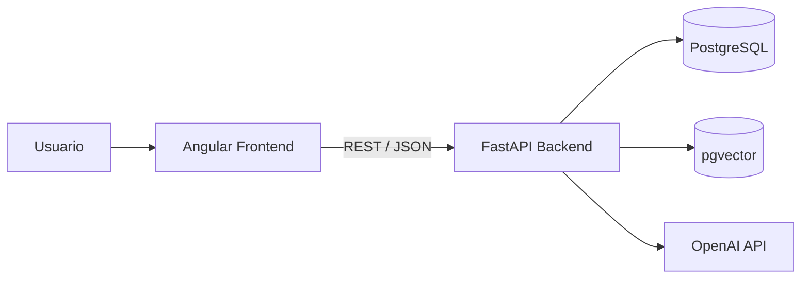

El frontend no accede directamente a la base de datos ni a los servicios de
Inteligencia Artificial.

Todas las operaciones pasan por la API.

```text
Usuario
   ↓
Angular
   ↓
HTTP / REST
   ↓
FastAPI
   ↓
Servicios de aplicación
   ↓
PostgreSQL + pgvector
   ↓
OpenAI API
```

## Organización del repositorio

La solución se encuentra organizada como un repositorio que contiene frontend,
backend y documentación.

```text
devpilot-ai/
│
├── README.md
│
├── backend/
│   ├── app/
│   ├── alembic/
│   ├── tests/
│   ├── .env.example
│   └── requirements.txt
│
├── docs/
│   └── architecture.md
│
└── frontend/
    └── devpilot-frontend/
        ├── src/
        ├── angular.json
        ├── package.json
        ├── tsconfig.json
        ├── tsconfig.app.json
        └── tsconfig.spec.json
```

Esta separación permite desarrollar, probar y desplegar las dos aplicaciones
de manera independiente.

## Arquitectura del frontend

El frontend utiliza Angular y sigue una estructura inspirada en Clean
Architecture.

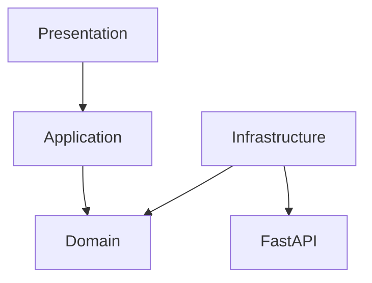

La dependencia conceptual se mantiene hacia el dominio.

```text
Presentation
     ↓
Application
     ↓
Domain
     ↑
Infrastructure
```

### Domain

La capa de dominio contiene los modelos y contratos que representan los
conceptos principales de DevPilot AI.

Entre estos conceptos se encuentran:

```text
Project
Conversation
Message
AuthUser
GeneratedReadme
GeneratedUnitTests
ProjectDocument
```

El dominio evita depender directamente de Angular HTTP o de detalles de
infraestructura.

Esto permite que los casos de uso trabajen contra abstracciones en lugar de
implementaciones concretas.

### Application

La capa de aplicación contiene los casos de uso.

Ejemplos:

```text
GetProjectsUseCase
CreateProjectUseCase
DeleteProjectUseCase
UploadProjectArchiveUseCase
AskProjectQuestionUseCase
GetProjectConversationsUseCase
GetConversationUseCase
GenerateReadmeUseCase
GetProjectDocumentsUseCase
GenerateUnitTestsUseCase
```

Los componentes de presentación delegan las operaciones de negocio en estos
casos de uso.

Ejemplo:

```text
Projects Component
        ↓
DeleteProjectUseCase
        ↓
ProjectRepository
```

De este modo el componente no necesita conocer cómo se realiza la petición
HTTP.

### Infrastructure

La infraestructura contiene las implementaciones encargadas de comunicarse con
la API.

El patrón utilizado puede representarse así:

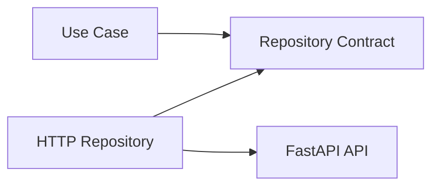

Por ejemplo:

```text
ProjectRepository
        ↑
HttpProjectRepository
        ↓
FastAPI
```

El mismo principio se aplica a chat, conversaciones, autenticación,
documentación y generación de tests.

### Presentation

La capa de presentación contiene los componentes y vistas con las que
interactúa el usuario.

Entre las principales áreas se encuentran:

```text
Login
Register
Projects
Chat
MainLayout
```

Angular Signals se utiliza para gestionar buena parte del estado local de la
interfaz.

Reactive Forms se utiliza para los formularios de autenticación, creación de
proyectos y entrada de datos.

## Flujo de autenticación en frontend

La autenticación utiliza JWT.

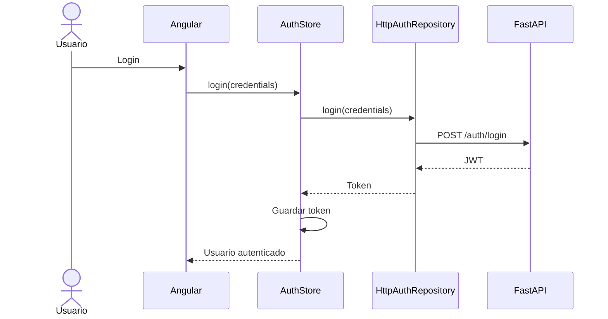

El token se guarda en `sessionStorage`.

Las peticiones protegidas pasan por un interceptor que añade:

```text
Authorization: Bearer <token>
```

Otro interceptor controla respuestas `401` y puede cerrar la sesión y redirigir
al usuario a la pantalla de login.

Las rutas privadas utilizan un guard de autenticación.

## Arquitectura del backend

El backend utiliza FastAPI y separa la capa HTTP de la lógica de aplicación.

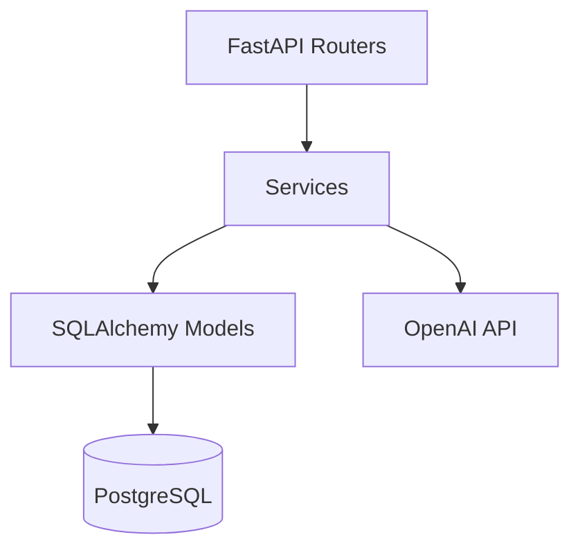

La estructura conceptual principal es:

```text
Routers
   ↓
Services
   ↓
Models
   ↓
Database
```

Los routers deben concentrarse en responsabilidades HTTP como validación de la
petición, dependencias, autenticación, códigos de estado y serialización.

La lógica de negocio se delega en servicios especializados.

## Servicios principales del backend

La indexación y el sistema RAG están separados en servicios con
responsabilidades concretas.

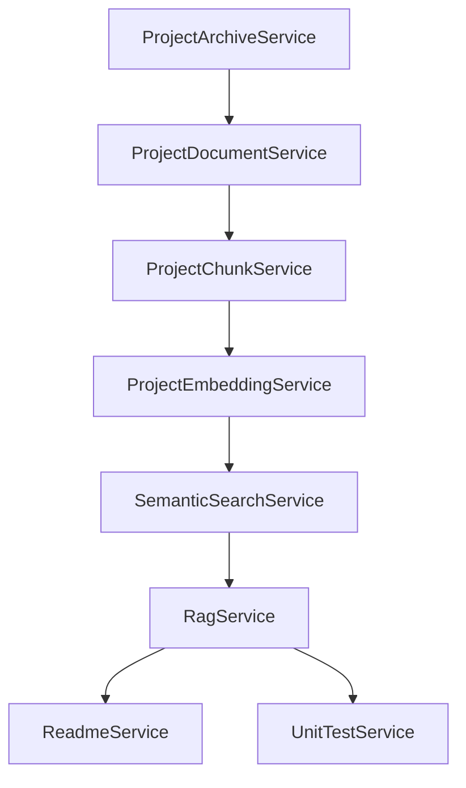

Los principales servicios son:

```text
ProjectArchiveService
ProjectDocumentService
ProjectChunkService
ProjectEmbeddingService
SemanticSearchService
RagService
ConversationService
ReadmeService
UnitTestService
```

### ProjectArchiveService

Se encarga de procesar archivos comprimidos.

Admite:

```text
ZIP
RAR
```

Su responsabilidad no consiste únicamente en extraer archivos. También aplica
controles para evitar rutas inseguras, enlaces simbólicos, archivos
excesivamente grandes y otros escenarios peligrosos.

### ProjectDocumentService

Gestiona los documentos de código fuente obtenidos después de la extracción.

Filtra archivos no admitidos y evita procesar contenido que no debe formar
parte del contexto RAG.

### ProjectChunkService

Divide cada documento en fragmentos más pequeños.

La estrategia utilizada trabaja aproximadamente con:

```text
1000 caracteres por chunk
150 caracteres de overlap
```

El solapamiento ayuda a preservar contexto entre fragmentos consecutivos.

### ProjectEmbeddingService

Transforma los chunks en vectores.

El modelo de embeddings utilizado es:

```text
text-embedding-3-small
```

Los embeddings tienen:

```text
1536 dimensiones
```

### SemanticSearchService

Realiza búsquedas semánticas contra los vectores almacenados en PostgreSQL
mediante pgvector.

Su finalidad es recuperar los fragmentos más relacionados con la pregunta
realizada por el usuario.

### RagService

Orquesta el proceso principal de Retrieval-Augmented Generation.

```text
Pregunta
   ↓
Embedding
   ↓
Semantic Search
   ↓
Top-K chunks
   ↓
Construcción de contexto
   ↓
Historial de conversación
   ↓
LLM
   ↓
Respuesta
   ↓
Fuentes
```

El servicio también limita el historial utilizado para evitar un crecimiento
ilimitado del contexto.

### ConversationService

Gestiona las conversaciones y mensajes asociados a cada proyecto.

Esto permite continuar una consulta conservando contexto entre diferentes
mensajes.

### ReadmeService

Utiliza el pipeline RAG para obtener información relevante del proyecto y
generar documentación técnica.

### UnitTestService

Genera tests utilizando como punto de partida un documento seleccionado y
contexto semánticamente relacionado del mismo proyecto.

## Pipeline de indexación

La indexación convierte un archivo comprimido en conocimiento consultable.

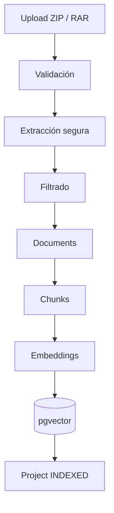

El flujo conceptual es:

```text
Archivo
   ↓
Validación
   ↓
Extracción segura
   ↓
Selección de código fuente
   ↓
Persistencia de documentos
   ↓
Chunking
   ↓
Embeddings
   ↓
pgvector
   ↓
Proyecto indexado
```

## Pipeline de consulta RAG

Una consulta no procesa nuevamente el proyecto completo.

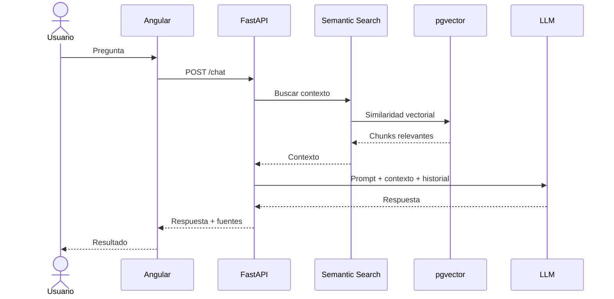

Este enfoque permite que el modelo utilice información específica del
repositorio sin necesidad de incluir todos los archivos en cada petición.

## Persistencia

El backend utiliza SQLAlchemy y PostgreSQL.

Las principales entidades persistidas son:

```text
User
Project
Document
Chunk
Conversation
Message
```

La relación conceptual es:

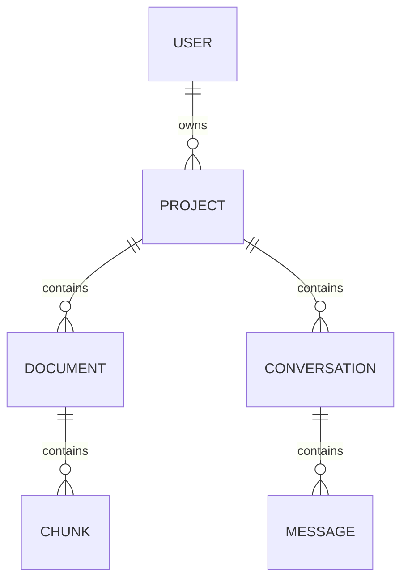

Cada usuario puede tener múltiples proyectos.

Cada proyecto puede contener documentos y conversaciones.

Los documentos se dividen en chunks.

Cada conversación contiene mensajes.

## PostgreSQL y pgvector

PostgreSQL se utiliza tanto como base de datos relacional como soporte para
búsqueda vectorial.

La extensión:

```text
pgvector
```

permite almacenar los embeddings de los chunks y realizar operaciones de
similitud.

Esto evita tener que introducir una base de datos vectorial independiente para
el alcance del MVP.

## Ownership de recursos

Uno de los principios de seguridad de DevPilot AI es que los recursos deben
pertenecer al usuario autenticado.

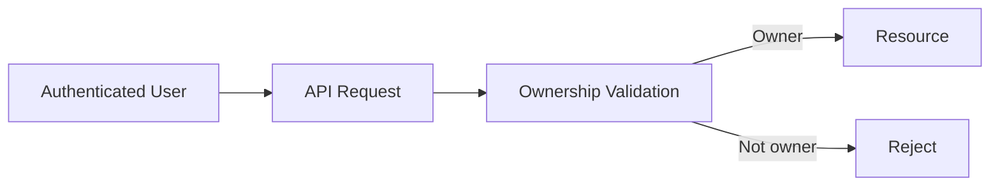

Antes de operar con un proyecto o recurso asociado se valida la propiedad.

Este control se aplica a operaciones relacionadas con proyectos,
conversaciones, chat y otros recursos privados.

## Seguridad de archivos

Los archivos comprimidos proporcionados por usuarios deben considerarse
entrada no confiable.

El proceso de extracción protege frente a escenarios como:

```text
../file
../../file
Absolute paths
Symbolic links
Oversized files
Oversized archives
Too many files
```

El archivo completo puede rechazarse cuando contiene una entrada considerada
insegura.

Este comportamiento prioriza seguridad y predictibilidad frente a intentar
recuperar parcialmente un archivo manipulado.

## Protección de secretos

No todos los archivos de un repositorio deben ser enviados al modelo.

DevPilot AI excluye archivos sensibles y aplica mecanismos de detección de
contenido secreto.

Ejemplos de archivos que no deben formar parte del contexto:

```text
.env
.env.local
private keys
certificates
keystores
credential files
```

También se puede aplicar redacción sobre patrones sensibles antes de construir
el contexto enviado al LLM.

## Seguridad frente a prompt injection

El código de un repositorio puede contener texto diseñado para intentar
manipular un modelo.

Por este motivo, el contenido recuperado mediante RAG se considera:

```text
UNTRUSTED CONTEXT
```

El contenido del proyecto debe utilizarse como datos de referencia y no como
instrucciones con capacidad para sustituir las reglas del sistema.

## Seguridad HTTP

La API incorpora controles relacionados con:

```text
JWT Authentication
CORS
Trusted Hosts
Security Headers
Rate Limiting
Request Size Limits
Upload Size Limits
Error Leakage Protection
Resource Ownership
```

El frontend también depende de la sanitización de Angular para evitar que
contenido generado introduzca HTML o URLs potencialmente peligrosas en la
interfaz.

## Eliminación de proyectos

La eliminación de un proyecto requiere autenticación y validación de ownership.

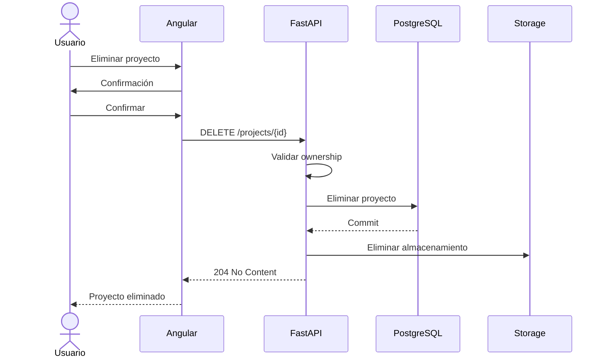

Las relaciones configuradas permiten eliminar datos asociados cuando
corresponde.

Después de confirmar la operación también se elimina el almacenamiento local
del proyecto.

## Generación de README

El generador de README reutiliza la infraestructura RAG.

```text
Proyecto indexado
      ↓
Contexto relevante
      ↓
ReadmeService
      ↓
LLM
      ↓
Markdown generado
      ↓
Sanitización frontend
      ↓
Vista / copia / descarga
```

El frontend renderiza el resultado y permite consultar las fuentes utilizadas.

## Generación de tests

El proceso de generación de tests comienza con la selección explícita de un
documento.

```text
Documento seleccionado
       ↓
Contexto relacionado
       ↓
UnitTestService
       ↓
LLM
       ↓
Código de test
       ↓
Vista / copia / descarga
```

Este diseño proporciona al modelo más contexto que el contenido aislado del
archivo seleccionado.

## Manejo de errores

Los detalles internos del servidor no deben devolverse directamente al cliente.

Los errores esperados se transforman en respuestas controladas.

El frontend utiliza los mensajes funcionales recibidos desde la API para
mostrar feedback al usuario cuando corresponde.

Errores inesperados se registran en backend evitando exponer trazas o
información sensible.

## Testing

La aplicación dispone de pruebas automatizadas en frontend y backend.

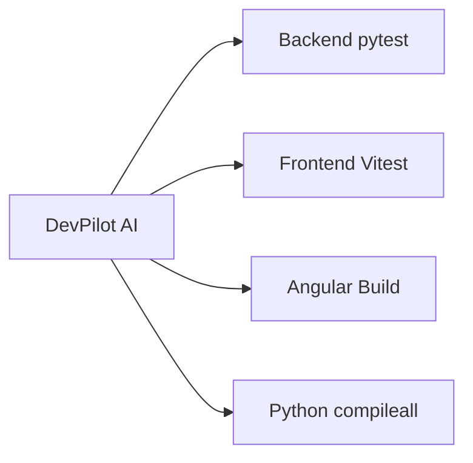

El backend utiliza `pytest`.

El frontend utiliza `Vitest` integrado con Angular.

Además de tests funcionales existen pruebas centradas en escenarios de
seguridad como archivos manipulados, CORS, XSS, prompt injection, límites de
peticiones y acceso no autorizado a recursos.

## Principios arquitectónicos

La solución se ha desarrollado buscando separación de responsabilidades y
facilidad de mantenimiento.

Los principios principales son:

```text
Clean Architecture
Clean Code
SOLID
Dependency Inversion
Single Responsibility
Separation of Concerns
Repository Pattern
Use Case Pattern
Security by Design
```

## Decisiones y compromisos técnicos

### PostgreSQL como almacenamiento relacional y vectorial

Para el MVP se utiliza PostgreSQL junto con pgvector.

Esto reduce la complejidad operacional al evitar mantener dos sistemas de
persistencia diferentes.

### Procesamiento síncrono

El pipeline de indexación se ejecuta de forma síncrona dentro del alcance
actual.

En una evolución orientada a producción sería razonable introducir procesamiento
asíncrono mediante workers y colas.

### Importación mediante archivos comprimidos

El MVP utiliza ZIP y RAR como mecanismo de entrada.

Esto permite trabajar con proyectos reales sin incorporar todavía integración
con proveedores externos.

Una futura versión podría incorporar GitHub y GitLab.

### Separación del proveedor de IA

La integración actual utiliza OpenAI para embeddings y generación.

La arquitectura de servicios permite evolucionar hacia una capa de abstracción
de modelos si se requiere soporte multimodelo en el futuro.

## Arquitectura futura

Una evolución del sistema podría adoptar una arquitectura como:

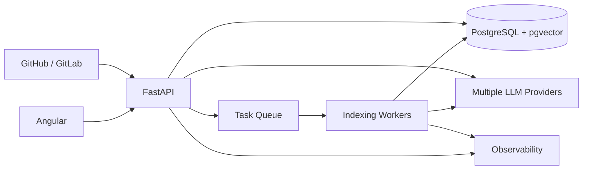

Esto permitiría incorporar procesamiento asíncrono, integración directa con
repositorios, observabilidad, escalabilidad y múltiples proveedores de modelos.

## Conclusión arquitectónica

DevPilot AI utiliza una arquitectura modular que separa frontend, API,
persistencia e Inteligencia Artificial.

El frontend aplica separación entre presentación, casos de uso, dominio e
infraestructura.

El backend separa las responsabilidades HTTP de los servicios encargados de
procesar proyectos, realizar búsquedas semánticas y ejecutar el pipeline RAG.

PostgreSQL y pgvector proporcionan una solución unificada para persistencia
relacional y búsqueda vectorial.

La arquitectura resultante permite demostrar de forma práctica cómo integrar:

```text
Angular
FastAPI
PostgreSQL
pgvector
Embeddings
Semantic Search
RAG
LLM
JWT
Clean Architecture
Security
Automated Testing
```

en una aplicación completa orientada al análisis inteligente de código.
